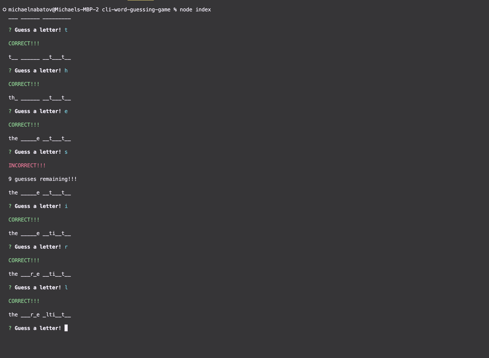
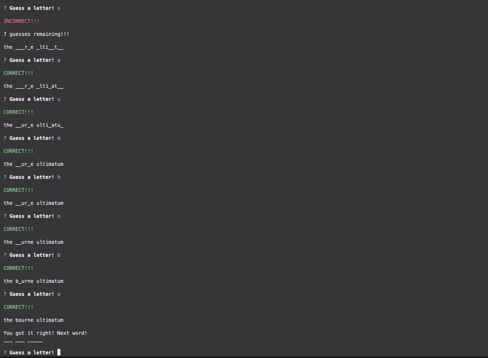
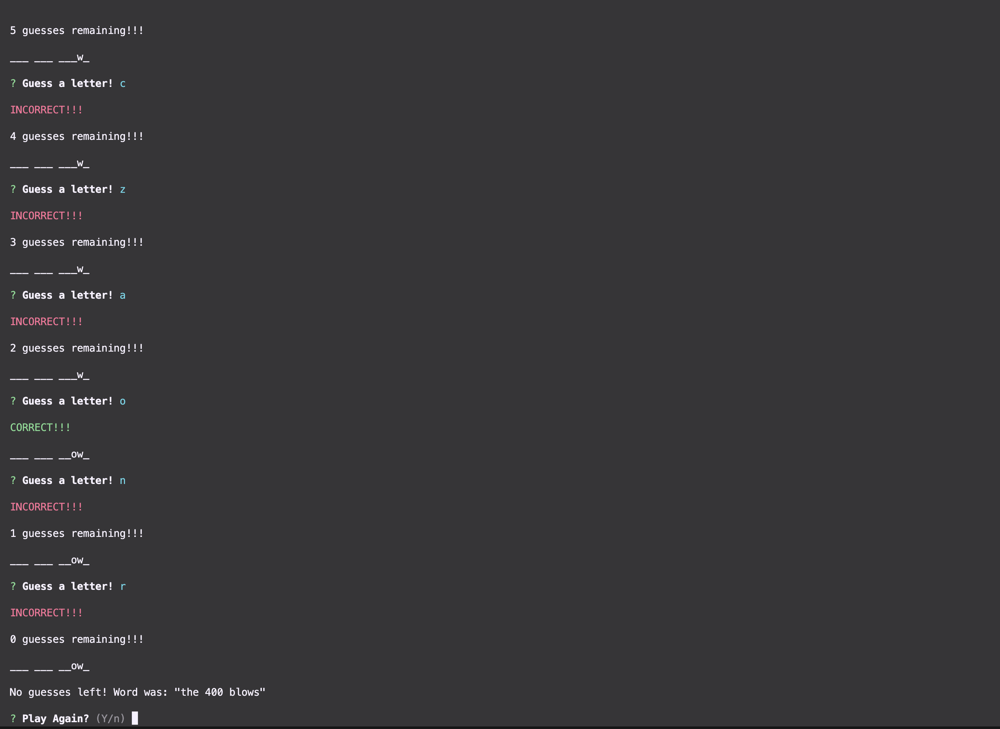

# Command-line Word Guessing Game 

## Description

This is a command-line tool that allows a developer to play an interactive word guessing game. This game is similar to hangman, where the user is prompted with a word to guess. User must enter one letter at a time, until he/she guesses the word, or has exhausted 10 tries. 

Once user guesses all characters, a winner message is displayed, and a new word is generated. If the 10 tries were exhausted, then a Game Over message is displayed, and the user is prompted to continue or quit.

---

## Table Of Contents
- [Installation](#installation)
- [Usage](#usage)
- [Contributing](#contributing)
- [License](#license)
- [Questions](#questions)

---

## Installation

N/A

---

## Usage

Type `npm index.js` in the command line and follow the prompts.

---

## Screenshots

---

## License

The MIT License

---

## Contributing

N/A

---

## Tests

N/A

---

## Questions

[Github Profile](https://www.github.com/mikeyboxx)

For any additional questions, you can contact me at

happyanddebtfree@gmail.com

---

